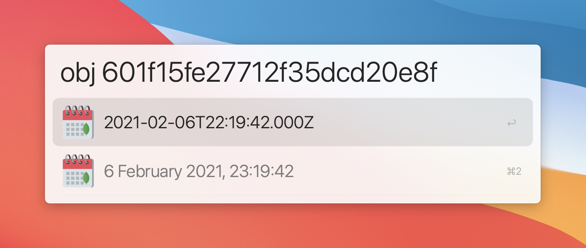

# alfred-objectid

An [Alfred](https://www.alfredapp.com) workflow that converts MongoDB ObjectIds to Timestamps.



## Installing the Workflow

[Download the latest release here](https://github.com/xanderberkein/alfred-objectid/releases). Open `alfred-objectid.workflow` to automatically install it in Alfred.

## Usage

```
obj [ObjectId]
```

The workflow will return two results:
- ISO 8601 timestamp in UTC time
- timestamp in your local time notation and timezone 

Press `cmd`+`return` (⌘↵) to copy the timestamp in the selected format to your clipboard.